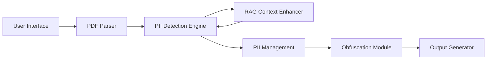
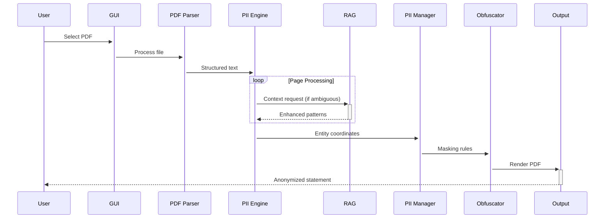

# PDF Bank Statement Obfuscator - Technical Architecture Document

## 1. Executive Summary
The PDF Bank Statement Obfuscator is a privacy-focused desktop application designed to process bank statements while removing personally identifiable information (PII) with surgical precision. Key characteristics include:

- **Complete Offline Processing**: Zero external API dependencies
- **AI-Powered Anonymization**: Leverages Mistral 7B via Ollama for context-aware PII detection
- **Transaction Integrity**: Preserves all financial data with 100% accuracy
- **Hardware Optimized**: Designed for Apple Silicon (M-series chips)
- **Configurable Architecture**: Supports model swapping for future enhancements

The solution addresses critical privacy concerns for financial professionals, auditors, and individuals who need to share bank statements while complying with data protection regulations.

## 2. System Overview
The application follows a modular pipeline architecture with seven core components:



**Key Data Flow**:
1. PDF upload through GUI
2. Text extraction with layout preservation
3. PII detection via LLM + RAG
4. Pattern-based redaction
5. Anonymized PDF generation

## 3. Detailed Technology Stack

| Component | Technology | Version | Rationale |
|-----------|------------|---------|-----------|
| **Core Language** | Python | 3.10+ | Rich ecosystem for PDF processing |
| **PDF Parsing** | PyMuPDF (fitz) | 1.23.8 | Superior layout preservation |
| **LLM Runtime** | Ollama | 0.1.34 | Local model execution |
| **Default LLM** | Mistral 7B | 7B-instruct | Balance of accuracy/speed |
| **Vector Database** | ChromaDB | 0.4.22 | Embedding storage for RAG |
| **GUI Framework** | PyQt6 | 6.6.1 | Cross-platform desktop UI |
| **Packaging** | PyInstaller | 6.2.0 | Single-binary distribution |
| **Testing** | pytest + Faker | 7.4.4 + 24.8.0 | Test automation |

## 4. Component Architecture

### 4.1 User Interface Module
- **Function**: File selection and processing controls
- **Elements**: 
  - PDF upload dialog
  - Processing progress bar
  - Output preview pane
- **Security**: Disabled network access controls

### 4.2 PDF Ingestion and Parsing
- **Process Flow**:
  1. Validate PDF structure
  2. Extract text blocks with positional metadata
  3. Identify tables and financial data sections
- **Output**: Structured document object with layout coordinates

### 4.3 PII Detection Engine
- **Core Logic**:
  ```python
  def detect_pii(text_chunk: str, rag_context: dict) -> list:
      prompt = f"Identify ALL PII in bank statement: {text_chunk}"
      response = ollama.generate(model=config.model, prompt=prompt)
      return parse_entities(response, confidence=0.85)
  ```
- **Features**:
  - Configurable model selection via model_selection.yaml
  - Confidence threshold adjustment
  - Batch processing for large statements

### 4.4 RAG Context Enhancer (Optional)
- **Components**:
  - **Knowledge Base**: Pre-loaded common PII patterns (account numbers, name formats)
  - **Retriever**: Semantic similarity search
- **Activation**: Only triggers for ambiguous detection cases

### 4.5 PII Management System
- **Entity Types Handled**:
  - Account/Credit Card Numbers
  - Personal Names
  - Addresses
  - Transaction References
- **Redaction Rules**: Pattern-preserving masking (e.g., "John Doe" → "XXXX XXX")

### 4.6 Obfuscation Module
- **Techniques**:
  - Direct text replacement in PDF canvas
  - Table cell value substitution
  - Metadata scrubbing
- **Integrity Checks**: Post-processing validation of transaction totals

### 4.7 Output Generator
- **Formats**: PDF/A-3 (archival grade)
- **Features**:
  - Password protection option
  - Checksum verification
  - Batch processing support

## 5. Data Flow Architecture



## 6. Security Architecture

### 6.1 Data Protection Measures
- **Memory-Only Processing**: No disk persistence of sensitive data
- **Secure Deletion**: `shred` compliant memory wiping
- **Network Isolation**: Disabled socket connections during processing

### 6.2 Privacy Safeguards
- **Zero Logging**: No processing metadata retention
- **User Data Control**: All files deleted after processing
- **Model Security**: Local LLMs only, no external validations

### 6.3 Attack Surface Mitigation
- **Input Sanitization**: PDF malware scanning
- **Resource Constraints**: Memory limits per document
- **Sandboxing**: AppArmor profiles for Linux/ macOS Gatekeeper

## 7. Development Roadmap

| Phase | Milestones | Duration | Dependencies |
|-------|------------|----------|--------------|
| **Core MVP** | PDF parsing + Mistral integration | 2 weeks | PyMuPDF, Ollama |
| **RAG Integration** | ChromaDB setup + prompt engineering | 1 week | Sentence transformers |
| **Performance Tuning** | Apple Metal acceleration | 3 days | MLX library |
| **UI Development** | PyQt interface + preview | 1.5 weeks | QT Designer |
| **Validation** | Accuracy/performance testing | 1 week | Synthetic datasets |

## 8. Testing Strategy

### 8.1 Test Categories
- **Unit Tests**: Mock PDFs with synthetic PII
- **Integration**: Component handoff validation
- **Accuracy Benchmarking**:
  - PII recall/precision (target: 98%+)
  - Transaction integrity (100% requirement)
- **Performance**: 
  - M2 Pro: < 30s per page (baseline)
  - Memory: < 500MB per document

### 8.2 Test Data Generation
```python
from faker import Faker

def generate_test_statement():
    fake = Faker()
    return {
        "name": fake.name(),
        "account": fake.iban(),
        "transactions": [{
            "date": fake.date(), 
            "amount": fake.pricetag()
        } for _ in range(100)]
    }
```

### 8.3 Security Validation
- OWASP ZAP baseline scans
- Memory forensics checks
- Dependency vulnerability scanning

## 9. Deployment Considerations

### 9.1 Hardware Requirements
- **Minimum**: Apple M1 Pro, 16GB RAM
- **Recommended**: M3 Pro, 32GB RAM for >100 page documents

### 9.2 Packaging Approach
- **Single Binary**: PyInstaller with ASLR support
- **Installers**: 
  - macOS: .dmg with notarization
  - Windows: Signed .exe
- **Size Estimation**: 450MB (includes Mistral 7B weights)

### 9.3 Configuration Management
```yaml
# model_selection.yaml
default_model: mistral:7b-instruct
fallback_model: llama3:8b
confidence_threshold: 0.85
rag_enabled: true
```

### 9.4 Update Mechanism
- Offline patch validation via SHA-256 checksums
- Manual update package installation
- Version compatibility checks